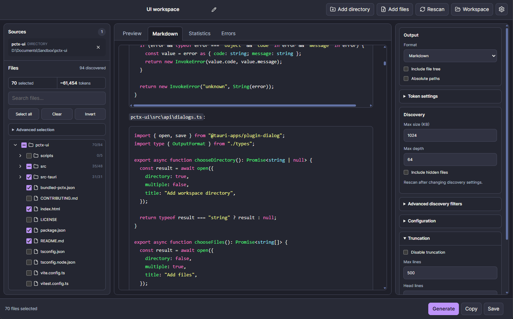

# pctx-ui

<p align="center">
  
</p>

A desktop interface for [`pctx`](https://github.com/mc-marcocheng/pctx), built with Tauri, React, and TypeScript.

`pctx-ui` helps you select files from one or more workspaces, tune filtering/truncation/output settings, preview generated context, and copy or save LLM-ready output.

## Features

- Add directories or individual files as workspace sources
- Browse and bulk-select files with a virtualized file tree
- Configure include/exclude patterns, size limits, truncation, and output format
- Preview generated Markdown/XML/plain context
- Render Markdown safely for easier review
- Copy to clipboard or save generated context to disk
- Create, save, import, export, and restore workspaces
- Choose an external `pctx` engine or use a bundled one when available
- Diagnostics panel for engine and operation troubleshooting
- Light, dark, system, built-in, and custom themes

## Downloads

GitHub releases provide two editions per platform:

- **Bundled:** includes the specific `pctx` version named in the download (currently `pctx-v1.1.0`) — no separate engine installation is required.
- **Unbundled:** requires a compatible `pctx` engine, `>= 1.1.0, < 2.0.0`, installed separately or selected via the in-app engine picker.

Install the engine for the unbundled edition with:

```bash
cargo install pctx
```

You can also configure an engine through `PCTX_BIN` or the in-app engine picker.

Bundled and unbundled installers are alternative editions of the same application and are not intended to be installed side by side.

Initial package formats:

- Windows: MSI and NSIS executable (`.exe`)
- macOS: DMG (x86_64 and ARM64)
- Linux: AppImage and DEB (x86_64)

Builds are currently unsigned. Windows may show a SmartScreen warning and macOS may show a Gatekeeper warning until code signing/notarization is added.

## Requirements

- A compatible `pctx` engine: `>= 1.1.0, < 2.0.0`
- For development:
  - Node.js/npm
  - Rust toolchain
  - Tauri system dependencies for your platform

Install the engine with:

```bash
cargo install pctx
```

Or point the app to a local engine with `PCTX_BIN` or the in-app engine picker.

## Development

```bash
npm install
npm run tauri dev
```

If `pctx` is not on your `PATH`:

```bash
PCTX_BIN=/path/to/pctx npm run tauri dev
```

## Build

Unbundled edition (no engine included):

```bash
npm run tauri:build:unbundled
```

Bundled edition (downloads and packages the pinned `pctx` release from `bundled-pctx.json`):

```bash
npm run tauri:build:bundled
```

Both accept Tauri arguments, e.g. `npm run tauri:build:unbundled -- --bundles msi,nsis`.

## Testing

Frontend tests:

```bash
npm test
```

Rust/Tauri tests:

```bash
cd src-tauri
cargo test
```

Contract tests require a real `pctx` binary. Set `PCTX_BIN` if it is not in the expected local path:

```bash
PCTX_BIN=/path/to/pctx cargo test --test contract
```

## Useful CLI Flags

`pctx-ui` accepts startup flags such as:

```bash
pctx-ui --workspace my-workspace.pctx-workspace.json
pctx-ui /path/to/project
pctx-ui --pctx-bin /path/to/pctx
pctx-ui --no-restore
pctx-ui --diagnostics
```
